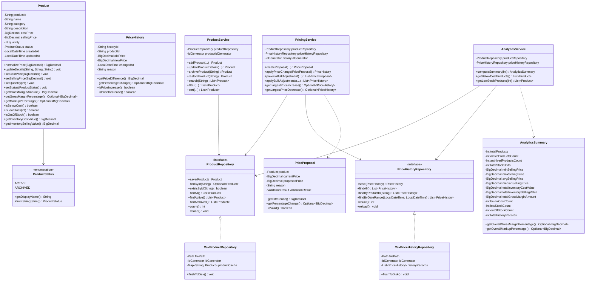

# UML Class Diagram — Product Price Management System (PPMS)

```mermaid
classDiagram
    direction TB

    class ProductStatus {
        <<enumeration>>
        ACTIVE
        ARCHIVED
        +getDisplayName() String
        +fromString(String) ProductStatus
    }

    class Product {
        -String productId
        -String name
        -String category
        -String description
        -BigDecimal costPrice
        -BigDecimal sellingPrice
        -int quantity
        -ProductStatus status
        -LocalDateTime createdAt
        -LocalDateTime updatedAt
        +normalizePrice(BigDecimal) BigDecimal
        +updateDetails(String, String, String) void
        +setCostPrice(BigDecimal) void
        +setSellingPrice(BigDecimal) void
        +setQuantity(int) void
        +setStatus(ProductStatus) void
        +getGrossMarginAmount() BigDecimal
        +getGrossMarginPercentage() Optional~BigDecimal~
        +getMarkupPercentage() Optional~BigDecimal~
        +isBelowCost() boolean
        +isLowStock(int) boolean
        +isOutOfStock() boolean
        +getInventoryCostValue() BigDecimal
        +getInventorySellingValue() BigDecimal
    }

    class PriceHistory {
        -String historyId
        -String productId
        -BigDecimal oldPrice
        -BigDecimal newPrice
        -LocalDateTime changedAt
        -String reason
        +getPriceDifference() BigDecimal
        +getPercentageChange() Optional~BigDecimal~
        +isPriceIncrease() boolean
        +isPriceDecrease() boolean
    }

    class PriceProposal {
        -Product product
        -BigDecimal currentPrice
        -BigDecimal proposedPrice
        -String reason
        -ValidationResult validationResult
        +getDifference() BigDecimal
        +getPercentageChange() Optional~BigDecimal~
        +isValid() boolean
    }

    class AnalyticsSummary {
        -int totalProducts
        -int activeProductsCount
        -int archivedProductsCount
        -int totalStockUnits
        -BigDecimal minSellingPrice
        -BigDecimal maxSellingPrice
        -BigDecimal avgSellingPrice
        -BigDecimal medianSellingPrice
        -BigDecimal totalInventoryCostValue
        -BigDecimal totalInventorySellingValue
        -BigDecimal totalGrossMarginAmount
        -int belowCostCount
        -int lowStockCount
        -int outOfStockCount
        -int totalHistoryRecords
        +getOverallGrossMarginPercentage() Optional~BigDecimal~
        +getOverallMarkupPercentage() Optional~BigDecimal~
    }

    class ProductRepository {
        <<interface>>
        +save(Product) Product
        +findById(String) Optional~Product~
        +existsById(String) boolean
        +findAll() List~Product~
        +findActive() List~Product~
        +findArchived() List~Product~
        +count() int
        +reload() void
    }

    class PriceHistoryRepository {
        <<interface>>
        +save(PriceHistory) PriceHistory
        +findAll() List~PriceHistory~
        +findByProductId(String) List~PriceHistory~
        +findByDateRange(LocalDateTime, LocalDateTime) List~PriceHistory~
        +count() int
        +reload() void
    }

    class CsvProductRepository {
        -Path filePath
        -IdGenerator idGenerator
        -Map~String, Product~ productCache
        +flushToDisk() void
    }

    class CsvPriceHistoryRepository {
        -Path filePath
        -IdGenerator idGenerator
        -List~PriceHistory~ historyRecords
        +flushToDisk() void
    }

    class ProductService {
        -ProductRepository productRepository
        -IdGenerator productIdGenerator
        +addProduct(...) Product
        +updateProductDetails(...) Product
        +archiveProduct(String) Product
        +restoreProduct(String) Product
        +search(String) List~Product~
        +filter(...) List~Product~
        +sort(...) List~Product~
    }

    class PricingService {
        -ProductRepository productRepository
        -PriceHistoryRepository priceHistoryRepository
        -IdGenerator historyIdGenerator
        +createProposal(...) PriceProposal
        +applyPriceChange(PriceProposal) PriceHistory
        +previewBulkAdjustment(...) List~PriceProposal~
        +applyBulkAdjustments(...) List~PriceHistory~
        +getLargestPriceIncrease() Optional~PriceHistory~
        +getLargestPriceDecrease() Optional~PriceHistory~
    }

    class AnalyticsService {
        -ProductRepository productRepository
        -PriceHistoryRepository priceHistoryRepository
        +computeSummary(int) AnalyticsSummary
        +getBelowCostProducts() List~Product~
        +getLowStockProducts(int) List~Product~
    }

    Product --> ProductStatus
    ProductRepository <|.. CsvProductRepository
    PriceHistoryRepository <|.. CsvPriceHistoryRepository
    ProductService --> ProductRepository
    PricingService --> ProductRepository
    PricingService --> PriceHistoryRepository
    AnalyticsService --> ProductRepository
    AnalyticsService --> PriceHistoryRepository
    PricingService ..> PriceProposal
    AnalyticsService ..> AnalyticsSummary
```
